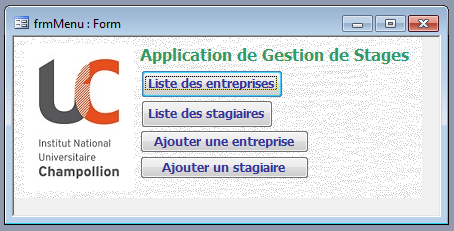
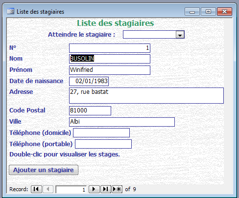
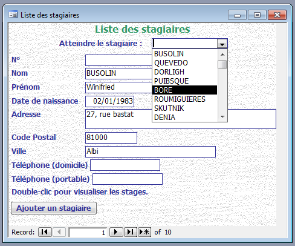
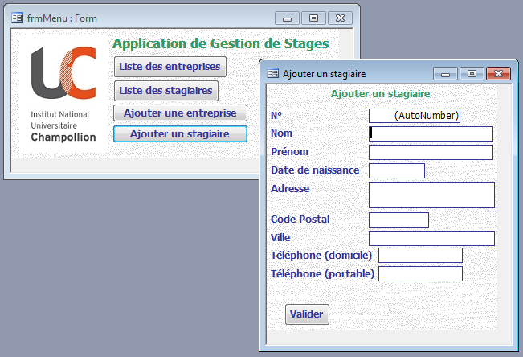

= Projet Access : +++ +++Application de Gestion de Stages
Julie Gleizes, Nathanael Bayard
L2 Info -- 2017/2018 -- Bases de Données 1

== Menu Principal
Le menu de l'application offre quatre boutons, deux permettant de lister les entreprises et les stagiaires, et deux permettant d'ajouter un nouveau stagiaire ou une nouvelle entreprise. Ces deux derniers boutons sont également accessibles depuis les formulaires qui listent les entreprises et les stagiaires.

.Menu de l'application

== Liste des Stagiaires
Ce formulaire s'inspire du formulaire qui liste les entreprises. Il contient un accès rapide et direct à la fiche d'un stagiaire par le biais d'une liste déroulante présentant la liste des noms des stagiaires.

.Formulaire de Liste des stagiaires

.Accès direct par nom de stagiaire

== Accès direct par nom d'entreprises
Le même mécanisme a été rajouté au formulaire qui liste les entreprises, pour éviter que les utilisateurs n'aient à connaître par coeur les numéros de référence correspondant aux diverses entreprises.

.Accès direct par nom d'entreprise
image::byName_e.png[Accès direct par nom d'entreprise]
{empty} +
Pour les deux menu déroulants d'accès rapide, s'il y a plusieurs stagiaires ou entreprises ayant le même nom, seul le premier sera accessible à travers cette fonctionalité.

== Formulaires d'ajout
Ci-dessous, les formulaires permettant d'ajouter de nouvelles entreprises ou stagiaires. Une macro assure que le curseur de clavier se positionne de lui-même sur le premier champ à renseigner, donc, en ignorant le champ de numéro de référence, puisqu'il est lui automatiquement généré.

.Ajout d'une entreprise depuis le Menu Principal
image::addE_mainmenu.png[Ajout d'une entreprise depuis le Menu Principal]
{empty} +

.Ajout d'un stagiaire depuis le Menu Principal

{empty} +

.Ajout d'un stagiaire depuis la Liste des Stagiaires
image::addS_stagiaires.png[Ajout d'un stagiaire depuis la Liste des Stagiaires]